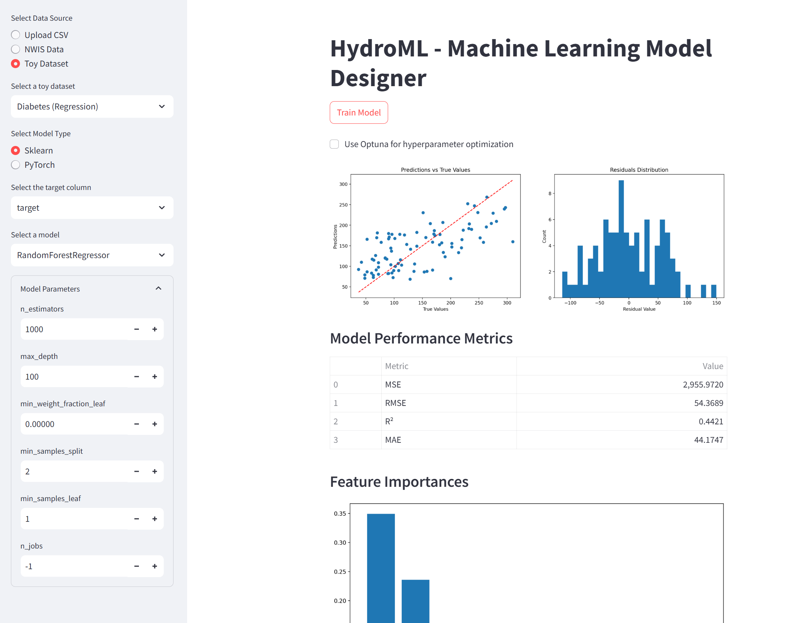

# HydroML: Machine Learning for Hydrological Data



## Overview
HydroML is an interactive machine learning application designed specifically for hydrological data analysis. It provides a user-friendly interface for data collection, preprocessing, model training, and evaluation, with special support for USGS NWIS (National Water Information System) data.

## Features

### Data Sources
- **USGS NWIS Integration**: Direct access to water data with filtering options
  - Multiple parameter selection
  - State and county filtering
  - Date range specification
  - High-frequency site identification
- **CSV Upload**: Support for custom datasets
- **Built-in Datasets**: Pre-loaded toy datasets for testing and learning

### Machine Learning Capabilities
- **Scikit-learn Models**:
  - Classification algorithms
  - Regression algorithms
  - Hyperparameter optimization with Optuna
  - Cross-validation support
  
- **PyTorch Models**:
  - Custom neural network architecture design
  - Multiple optimizer options (Adam, SGD, RMSprop, AdamW)
  - Hyperparameter tuning with Optuna
  - Flexible layer configuration

### Visualization
- Interactive plots using Plotly
- Model performance metrics
- USGS site location mapping
- Training progress monitoring

## Installation

1. Clone the repository:

```bash
git clone https://github.com/yourusername/HydroML.git
cd HydroML
```

2. Install dependencies:
```bash
pip install -r requirements.txt
```

## Usage

1. Start the application:
```bash
streamlit run streamlit_HydroML.py
```

2. Select your data source:
   - Upload a CSV file
   - Connect to USGS NWIS
   - Use a toy dataset

3. Choose your model type:
   - Scikit-learn for traditional ML algorithms
   - PyTorch for deep learning

4. Configure and train your model:
   - Set hyperparameters manually or use Optuna
   - Monitor training progress
   - View performance metrics

## Requirements
- Python 3.8+
- Streamlit
- PyTorch
- Scikit-learn
- Pandas
- NumPy
- Plotly
- Optuna

## Project Structure
```
HydroML/
├── src/
│   ├── app.py
│   ├── utils/
│   │   ├── nwis_data.py
│   │   └── data_processing.py
│   └── models/
│       ├── sklearn_models.py
│       └── pytorch_models.py
├── streamlit_HydroML.py
├── requirements.txt
└── README.md
```

## Contributing
Contributions are welcome! Please feel free to submit a Pull Request. For major changes, please open an issue first to discuss what you would like to change.

1. Fork the repository
2. Create your feature branch (`git checkout -b feature/AmazingFeature`)
3. Commit your changes (`git commit -m 'Add some AmazingFeature'`)
4. Push to the branch (`git push origin feature/AmazingFeature`)
5. Open a Pull Request

## License
This project is licensed under the MIT License - see the LICENSE file for details.

## Acknowledgments
- USGS for providing access to the National Water Information System
- Streamlit for the interactive web framework
- The scientific Python community for the amazing tools

## Citation
If you use HydroML in your research, please cite:
```bibtex
@software{hydroml2024,
  author = {Your Name},
  title = {HydroML: Machine Learning for Hydrological Data},
  year = {2024},
  url = {https://github.com/yourusername/HydroML}
}
```
